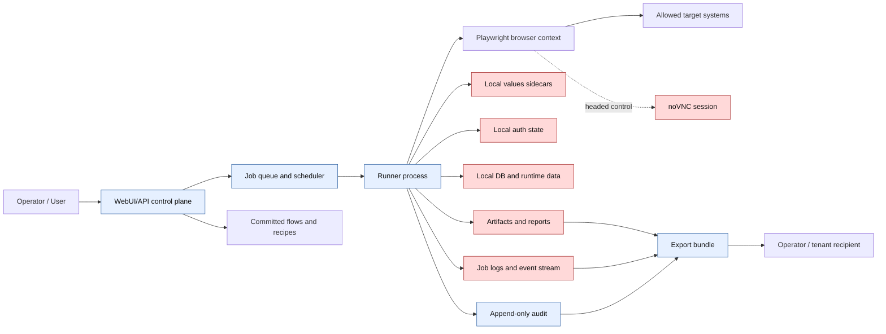

# Security Data Policy

Status: active policy draft
Date: 2026-06-10
Scope: Browser-auto productization threat model, data-flow boundaries, audit retention, artifact
retention, and export rules for the internal pilot and any future external service open.

This policy is the data-handling companion to `PILOT-SERVERIZATION.md`,
`INTERNAL-PILOT-RUNBOOK.md`, and `P0-SERVICE-OPEN.md`. It does not make the current localhost
implementation externally safe by itself. External service open remains no-go until the P0 controls in
`P0-SERVICE-OPEN.md` are implemented and tested.

## 1. Security Postures

Browser-auto has two distinct operating postures:

| Area | Internal pilot | External service open |
| --- | --- | --- |
| Operator model | Single trusted operator on a trusted Windows host | Multi-user, tenant-scoped users with RBAC |
| Network exposure | Loopback webui/noVNC or authenticated tunnel only | Authenticated HTTPS service, TLS noVNC, deny-by-default CORS |
| Secrets | Local gitignored files only | Encrypted tenant-scoped storage with rotation and deletion |
| Runtime authority | Supervised headed or headless runs | Durable jobs, tenant isolation, audit, cancel/reconcile |
| Data upload | Keep raw tenant data local by default | Scrubbed metadata only unless tenant policy explicitly allows upload |
| Export | Manual local collection after review | Policy-gated bundle after secret scan and redaction |

Internal pilot controls are compensating controls for a trusted host. They are not acceptable controls
for a public or multi-tenant service.

## 2. Threat Model

Primary assets:

- Browser auth state: `fixtures/auth/playwright/*.state.json` and approve compatibility state.
- Flow values: gitignored `flows/*.values.json` sidecars containing passwords, OTP-adjacent values,
  account IDs, or other form input.
- Local DB and runtime data: files under `data/`, including registry, job, audit, scheduler, and stop
  files when present.
- Artifacts: `artifacts/<RUN_ID>/` reports, screenshots, videos when enabled, downloads, snapshots,
  result TSV/JUnit, and runner output.
- noVNC/headed browser sessions: live browser pixels, keyboard/mouse control, downloads, cookies,
  local storage, and open target pages.
- Job logs and event streams: child process output, status events, target keys, error reasons, command
  arguments, and result summaries.

Threat actors:

- Unauthenticated network user reaching webui, noVNC, artifact routes, or job event streams.
- Authenticated user crossing role or tenant boundaries.
- Malicious target page attempting CSRF, cross-origin requests, redirects, iframes, downloads, or
  browser egress to internal addresses.
- Operator error that commits, uploads, pastes, exports, or shares secret-bearing local files.
- Compromised runner host or child process reading sibling tenant state or stale browser profiles.
- Log or artifact consumer receiving raw credentials, cookies, business records, or screenshots.

Required fail-closed outcomes:

- Any route that can spawn a process, open a browser, control noVNC, read artifacts, mutate data, or
  stream logs requires authenticated tenant-scoped authorization in external mode.
- Auth state, values, DB files, browser profiles, raw artifacts, and raw job logs are never statically
  served or exported as raw bundles.
- Browser egress outside tenant allowlists, including redirects and iframes, aborts the job and writes
  a redacted audit event.
- Cross-tenant access by guessed path, ID, websocket URL, run ID, artifact URL, or cache key is denied.
- Export is blocked until secret scanning and redaction complete successfully.

## 3. Data Flow

Boundary rules:

- Control plane metadata can reference flows, recipes, jobs, run IDs, hashes, status, and redacted
  audit summaries.
- Auth state and values are credentials. They stay in local or encrypted tenant-runner storage and are
  never returned by WebUI APIs, job events, reports, audit summaries, exports, or static routes.
- Local DB/runtime data under `data/` is not a public API surface. External mode must split durable
  metadata from tenant confidential state and enforce tenant IDs in every key.
- Artifacts may contain tenant data even when reports look harmless. Treat every artifact path as
  tenant-confidential until scanned and redacted.
- noVNC is live control of an authenticated browser. External mode requires TLS, login, authorization,
  session binding, idle timeout, hard timeout, and per-job or per-tenant browser isolation.
- Job logs and event streams are operational data, not safe telemetry by default. External mode must
  redact secrets, target URL parameters, form values, cookies, headers, and raw document bodies before
  persistence or streaming.

## 4. Data Classification And Boundaries

| Data class | Examples | Internal pilot boundary | External service open boundary |
| --- | --- | --- | --- |
| Public code/config | Source, committed flows, recipes without secrets | May be committed after review | May be stored in control plane |
| Sensitive metadata | Tenant ID, system name, flow hash, job status, target host | Local artifacts and operator notes | Tenant-scoped metadata store with RBAC |
| Credentials | Auth state, cookies, OTP seeds, passwords, values | Local gitignored files only | Encrypted tenant-scoped secret store |
| Raw tenant data | Screenshots, downloads, document bodies, extracted records | Local operator host only | Tenant runner only unless policy allows upload |
| Operational logs | Job stdout/stderr, event stream, scheduler log | Local review, redact before sharing | Redacted durable logs with retention policy |
| Audit evidence | Actor, route, job state, hashes, egress denials, artifact reads | Local append-only evidence where available | Append-only tamper-evident audit or external sink |

## 5. Audit Retention Policy

Minimum audit fields:

- Actor/user, role, tenant, session/IP where available, route/API, command, target system, job ID,
  flow or recipe hash, policy mode, job state transition, noVNC access, egress denial, artifact access,
  export decision, input redaction status, result, timestamp, and integrity hash.

Retention:

- Internal pilot: keep audit evidence and matching artifacts until pilot closeout and issue triage are
  complete. Delete local audit copies only after the operator records the run ID, target system, outcome,
  and any incident disposition.
- External service open: keep security audit events for at least 180 days by default, or longer when a
  tenant contract or legal hold requires it. Keep audit records append-only and tenant-scoped.
- Incident hold: suspend deletion for any tenant, job, artifact, auth event, export, or noVNC session
  involved in an open incident.

Deletion and access:

- Audit deletion must be an administrative retention action, not a normal operator route.
- Normal WebUI users can view only redacted, tenant-scoped audit summaries.
- Raw audit storage must not include cookie values, passwords, OTPs, bearer tokens, full headers, raw
  form values, or full document bodies.
- Audit export follows the export policy in section 7 and is blocked if redaction status is unknown.

## 6. Artifact Retention Policy

Default handling:

- `artifacts/<RUN_ID>/`, screenshots, videos, downloads, snapshots, reports, and `results.tsv` are
  tenant-confidential runtime output.
- Internal pilot artifacts stay on the operator host and are not committed, pasted into chat, or served
  beyond loopback/authenticated access.
- External service open requires tenant-scoped artifact metadata with job ID, tenant ID, flow/recipe
  hash, creation time, retention class, scan status, redaction status, integrity hash, and deletion due
  time.

Retention classes:

- Ephemeral debug: default for screenshots, videos, downloads, raw reports, and raw logs. Delete after
  7 days unless attached to an issue or incident.
- Pilot evidence: keep until closeout plus 30 days, then prune unless the target owner requests longer
  retention.
- Audit-linked evidence: keep as long as the corresponding audit or incident hold requires.
- Tenant-approved archive: keep only when a documented tenant policy permits storing raw tenant data.

Deletion rules:

- Tenant deletion removes or tombstones tenant-scoped artifacts, job logs, browser state, and secrets
  according to retention and legal-hold policy.
- Artifact delete must remove both bytes and metadata references, or leave a tombstone that proves
  deletion without leaking content.
- External mode must deny direct path traversal, guessed run IDs, stale signed URLs, and cross-tenant
  artifact reads.

## 7. Export Policy

Raw export is blocked by default.

An export bundle may be created only when all conditions are true:

- The requester is authorized for the tenant and export scope.
- The export scope lists exact jobs, artifacts, audit records, and date range.
- Secret scanning has completed for every included artifact, job log, report, JSON, TSV, screenshot
  metadata, and generated file.
- Redaction has removed or masked cookies, passwords, OTPs, bearer tokens, headers, local storage,
  `.values.json` content, auth state, DB files, private URLs, and raw document bodies not approved for
  export.
- The bundle manifest records tenant, requester, purpose, included IDs, hashes, scan tool/version,
  redaction status, creation time, retention class, and expiration.
- The export action writes an audit event with the manifest hash and redaction status.

Blocked export inputs:

- Auth state files, approve state files, raw `.values.json`, browser profiles, raw local DB files,
  unredacted job logs, unredacted screenshots/videos, raw downloads, and any artifact whose scan status
  is missing, failed, or stale.

Internal pilot sharing:

- Prefer a short written summary with run ID, command, result, and redacted error reason.
- Share raw artifacts only with the target system owner or approved internal reviewer after manual
  secret review.

## 8. Readiness Gates

Internal pilot is go only when:

- WebUI and noVNC are loopback or externally authenticated.
- Auth state, values, DB, artifacts, and job logs are gitignored and not staged.
- The operator reviews artifacts locally before sharing.
- Live actions are supervised, bounded, and dry-run first.

External service open is no-go until:

- Auth/RBAC, CSRF, tenant IDs, egress allowlists, durable jobs, audit, noVNC isolation, secret storage,
  artifact retention, and export controls are implemented and tested.
- Security tests prove cross-tenant access fails for WebUI, API, noVNC, artifacts, job logs, and audit.
- Raw export cannot bypass secret scanning and redaction.
- Audit readback can prove who did what, to which tenant/system, with which flow/recipe hash, and with
  which artifact/export hash.
